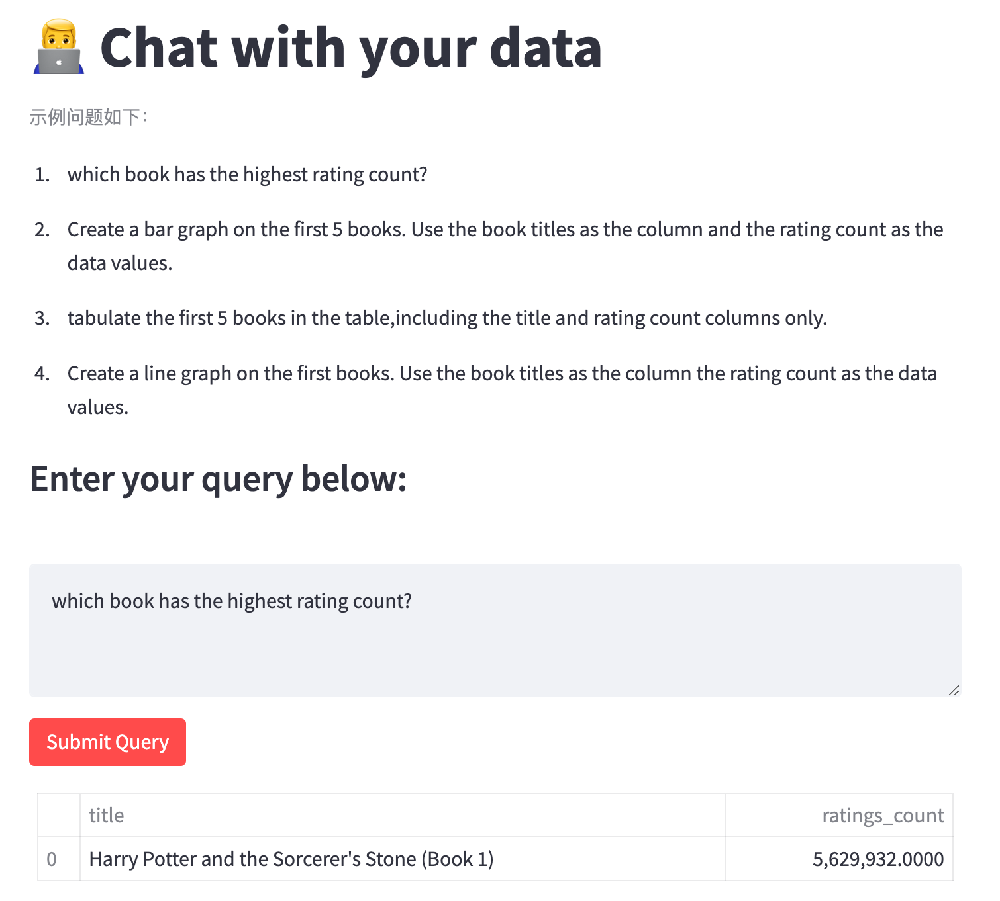
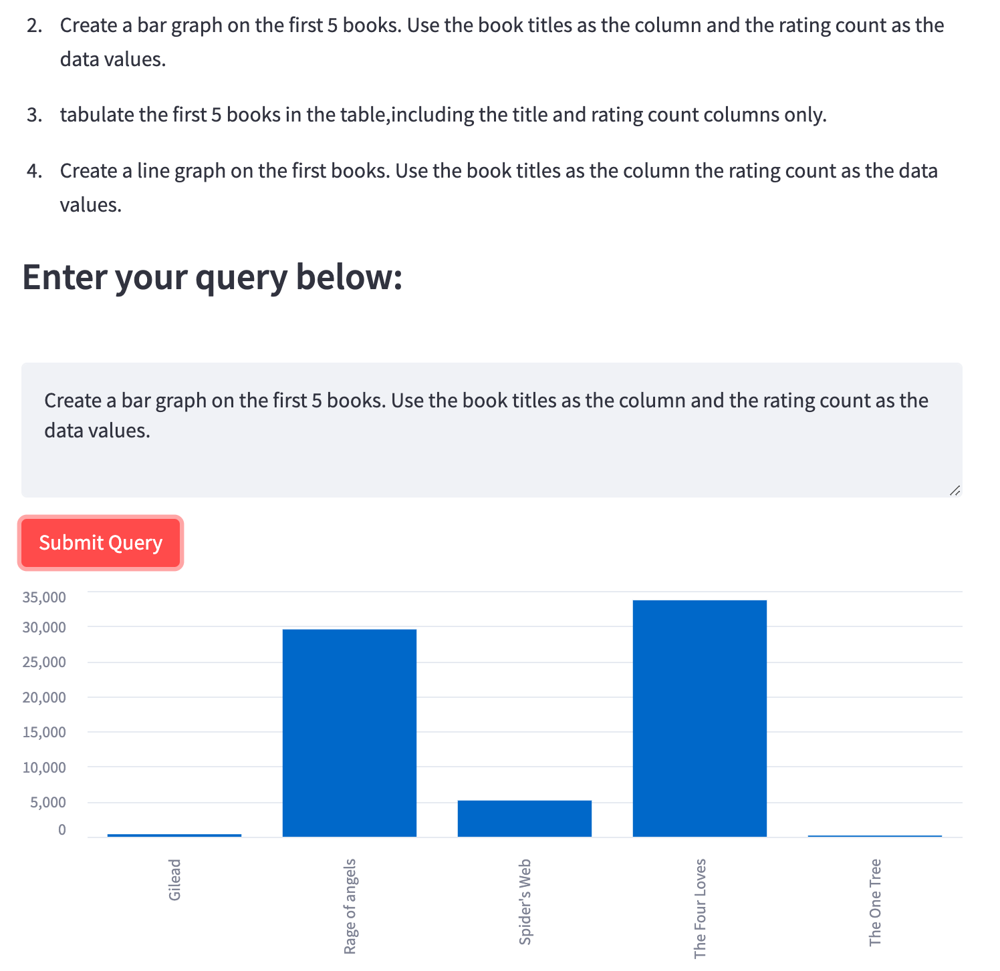
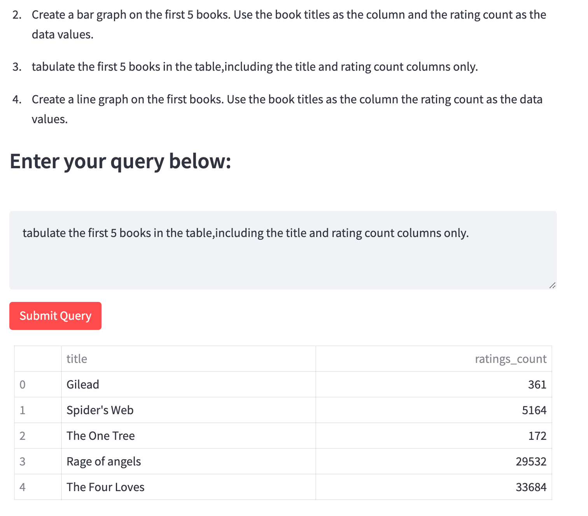
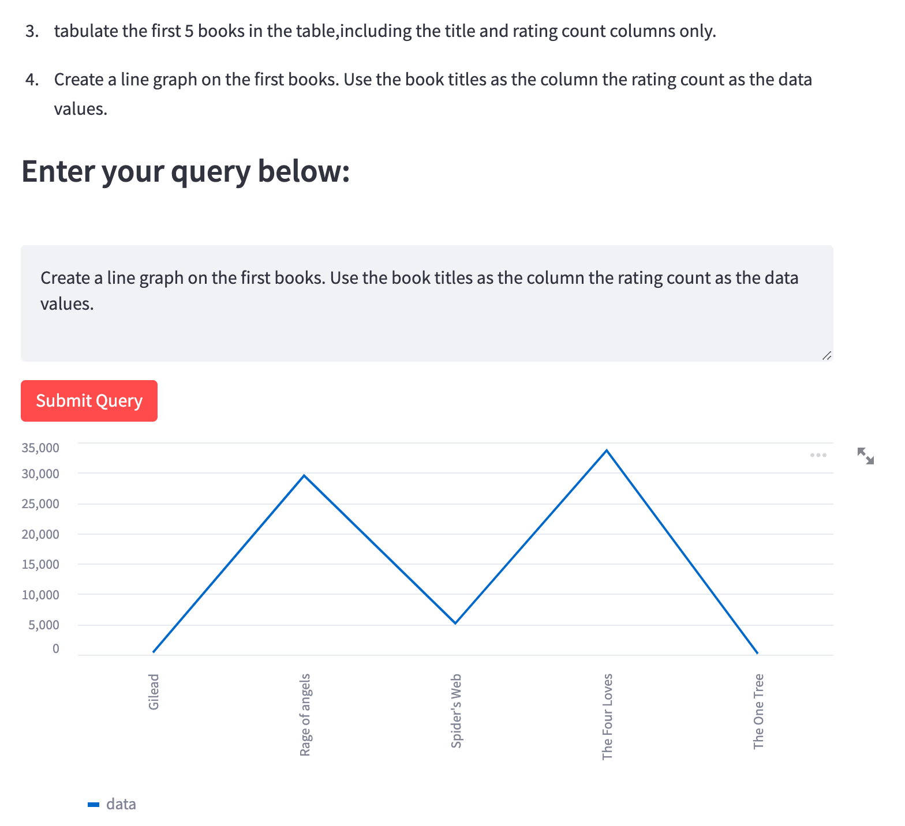

# Chat with your CSV: Visualize Your Data with Langchain and Streamlit

Repository for the application built in [this](https://dev.to/ngonidzashe/chat-with-your-csv-visualize-your-data-with-langchain-and-streamlit-ej7) article.

视频讲解B站链接地址：https://www.bilibili.com/video/BV1pj411S7RC/

## Requirements

Install the required packages by running

```
pip install -r requirements.txt
```

## Interface

---

---

---

---
